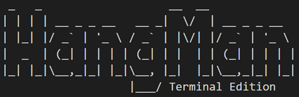

                  

# Deployment
## Arm Cortex-M4 Base Project
Example Workspace für die Vorlesung Systemnahe Programmierung 2 an der
DHWB Ravensburg.

### Arm Documentation
 - [Cortex M4 Startseite](https://developer.arm.com/Processors/Cortex-M4)
 - [ARMv7-M Architecture Reference Manual](https://developer.arm.com/documentation/ddi0403/latest/)
 - [Cortex-M4 Devices Generic User Guide](https://developer.arm.com/documentation/dui0553/b/?lang=en)
 - [Arm Cortex-M4 Processor Technical Reference Manual Revision r0p1](https://developer.arm.com/documentation/100166/0001/?lang=en)
 - [Arm Application Binary Interface](https://github.com/ARM-software/abi-aa)
 - [GNU Assembler Documentation](https://sourceware.org/binutils/docs-2.40/as/index.html)
 - [GNU Linker Documentation](https://sourceware.org/binutils/docs-2.40/ld/index.html)

### Prerequisites
 - CMake
 - Arm GCC Cross-Compiler
 - Wind River Simics

### Building
Auschecken des Quellcodes:
`git clone https://github.com/infohoschie/Arm-Cortex-M4-Base.git`

Erstellen des Build:
 - Mittels CMake Presets:
   ```cmake --preset arm-cortex-m4```
 - Klassisch:
   ```cmake -B build -S . -DCMAKE_BUILD_TYPE=Debug -DCMAKE_TOOLCHAIN_FILE=toolchain.cmake```
 - Caro:
   ```cmake --preset arm-cortex-m4 -G "Unix Makefiles"```

Bauen:
 - Mittels CMake Presets:
   ```cmake --build --preset arm-cortex-m4```
 - Klassisch:
   ```cmake --build build .```
      
Neue .c files immer in CmakeList.txt einfügen unter "target_sources"
 
### Running in Wind River Simics
Install Wind River Simics (Currently only for Windows and Linux available)

**Note**
For Linux installation assure, that I386 Support is available, e.g. for 
Ubuntu/ Debian: ```sudo dpkg --add-architecture i386```

Propagate the License Server via environment variable:
```SIMICS_LICENSE_FILE=27000@wrs-lizenz.inf.dhbw-ravensburg.de```

Start Simics, e.g. via command-line:
```<SIMICS_INSTALL>/bin/simics6_22_12/simics-6/simics-6.0.154/bin/simics-eclipse```
Create Simics Workspace

Create Simics Project: File -> New -> Simics Project

Via Tab *Simics Control* create new *Simics Session*.
Select *Target System*: *arm-cortex-m4-ref - cortex-m4-ref-helloworld*
Modify *Parameters*: *Runtime* -> *demo_image* set to built binary
Select *Start as debug session*

#

# Project Conventions

## IDEs

 - Jetbrains CLion
   Das Projekt kann direkt in der IDE geöffnet (ausgechecked) werden.
   Die CMake Presets werden direkt als build-target angeboten

 - Visual Studio Code

## Agreements
 - Language: English

## Tools
 - ASCII Art: http://www.patorjk.com/software/taag/#p=display&h=3&f=Standard&t=You%20%20%20win%20!%0A%0A
 - Font: Big

#

# User Manual

## Start
Start the simics project, press F6 and switch to the serial console. Press "s" or "S" to start the game. Hans, the Hangman will guide you through the game.

Player 1: You can now type a word with a maximum of 25 letters that you want your friends to guess. Of course, your word won't show so that your friends won't see it and the suspence is kept. Remember not to use special characters such as "ä, ö, ü", numbers or punctuation characters. Words with hyphens or spaces are not allowed. You don't need to care about case-sensitivity, lower-case letters and capital letters are fine. 

Please mind that once you typed in a letter, there's no way back. The delete-key will not be accepted.

To confirm your word, press "Enter".

In case you need inspiration for good guessing words, check out the word lists ["word_inspo_A"](word_inspo_A.txt) and ["word_inspo_B"](word_inspo_B.txt). The lists contain different words, so you can play in turns without using the same words.

## Game
Player 2: Type in the letters you expect in the word. Under the graphic that shows your progress, you'll be shown the letters you already guessed correct as well as the letters you guessed wrong.

Keep in mind: time is ticking - if you need too long for your guess, it will be counted as a wrong guess.

## Game over
After each round Hans, the Hangman, will leave a comment about how well you did. Furthermore, you'll be shown you game statistics when you press any key.

## Try again
Once you finish a round, Hans, the Hangman, wheteher dead or alive, will offer you another game. Press "p" or "P" to accept.

## End
In case you're not in for another round, press any other key and Hans, the Hangman, will greet goodbye an tell you who was involved in the making of HangMan - Terminal Edition.